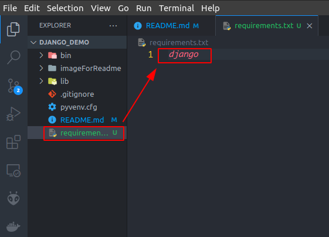
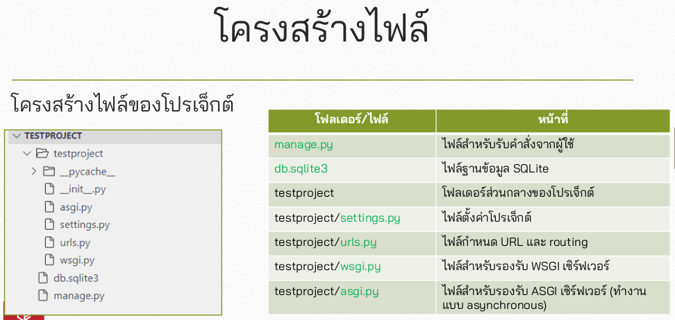
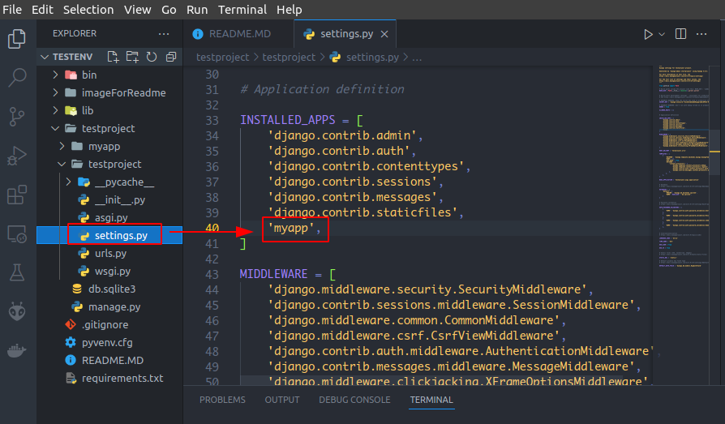
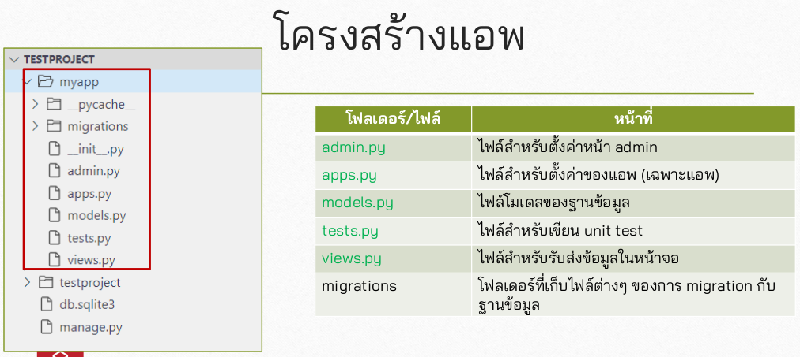
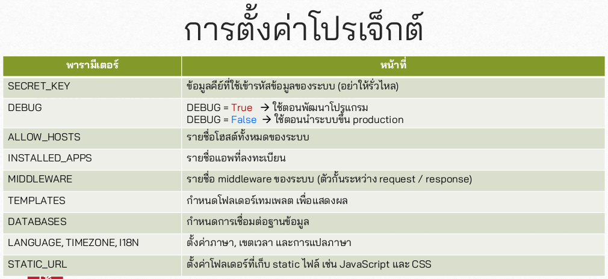
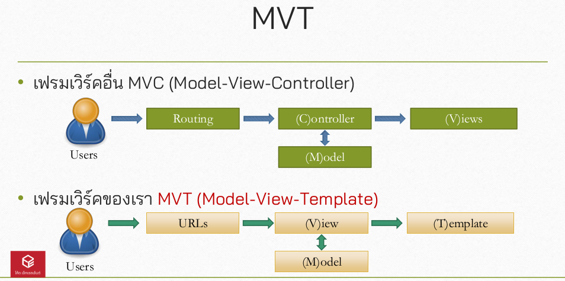
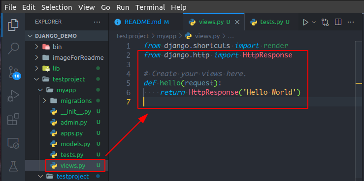
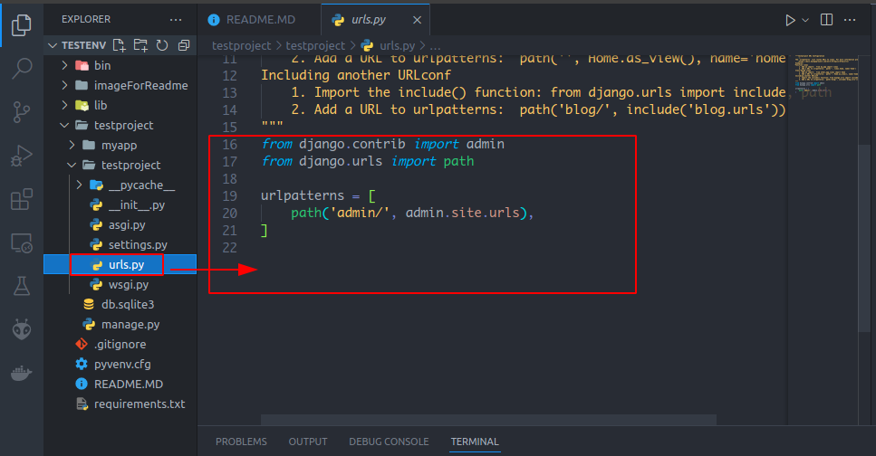

# django


```
$ python3 -V
$ pip3 -V
```

```
$ pip3 install virtualenv
$ virtualenv testenv
OR
$ virtualenv django_demo
```


## Prepare For Use Git
* ### Create Repository in github
* ### Create `Readme.md` Files
```
$ git init
$ git add README.md
$ git commit -m "first commit"
$ git branch -M main
$ git remote add origin https://github.com/YuttanaSRMUTT/django_demo.git
$ git push -u origin main
```

```
$ git add .
$ git status
$ git commit -m "a1"
$ git push
```


## 1.1. เข้าไปใน folder testenv

* activate
    ```
    $ source ./bin/activate
    ```
* deactivate
    ```
    $ deactivate
    ```
    

## 1.2. ก่อน install django ให้ activate testenv ก่อน

* Create Files Named `requirements.txt` พิมพ์ชื่อ libery ที่ต้องการ installl ลงไป เช่น `django`


    ```
    $ pip3 install -r requirements.txt
    ```


## 1.3. Create Project
```
$ django-admin startproject testproject
```

## 1.4. เข้าไปใน directory `testproject` 

```
$ cd testproject
```

## 1.5. Runserver
```
$ python3 manage.py runserver
```
ออกจาก Server ให้พิมพ์ `Ctrl+C`

## 1.6. Sturcture Files


## 1.7. Create APP
```
$ python3 manage.py startapp myapp
```

## 1.8. Combine myapp in setting.py



## 1.9. Strueture app


## 1.10. setting.py


* `SECRET_KEY`
* `DEBUG`
* `ALLOW_HOSTS`
* `INSTALLED_APPS`
* `MIDDLEWARE`
* `TEMPLATES`
* `DATABASES`
* `LANGUAGE, TIMEZONE, I18N`
* `STATIC_URL`

## 2.1 MVT


## 2.2 URLs
* ### Create Rounting ขั้นตอนแรกสร้าง Function ที่จะแสดงข้อมูลออกทางหน้า Page ก่อน โดยการสร้าาง Function hello ใน views.py

```python
# testproject/myapp/views.py
from django.shortcuts import render
from django.http import HttpResponse

# Create your views here.
def hello(request):
    return HttpResponse('Hello World')
```


* ### mapping `urls.py` patern


```python
# /testproject/testproject/urls.py

from django.contrib import admin
from django.urls import path
from myapp import views

urlpatterns = [
    path('admin/', admin.site.urls),
    path('hello/', views.hello),
]
```


